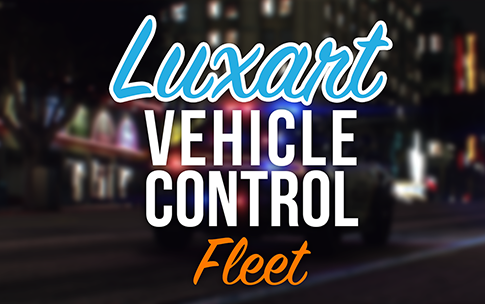
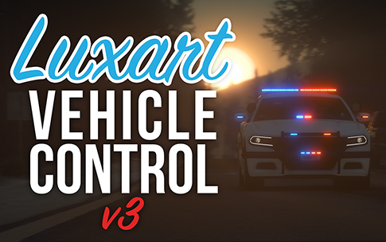

# Welcome to Luxart Engineering

## Luxart Vehicle Control: <mark style="color:orange;">Fleet</mark>

The new an improved latest resource from Luxart Engineering, coming soon!

<figure><figcaption>
LVC:F Logo
</figcaption></figure>


[README (1).md](<README (1).md>)



[resource-installation.md](installation-and-configuration/resource-installation.md)




## Luxart Vehicle Control <mark style="color:red;">v3</mark>

The O.G. modified emergency light and siren controller for FiveM.

<figure><figcaption>
LVC v3 Logo
</figcaption></figure>




