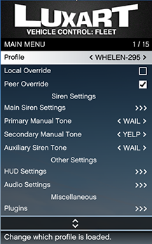

# 🎮 In Game Use Guide

#### LVC:F Menu

The LVC:F menu can be opened by default using `O` as in Oscar this can be changed in [base settings](../installation-and-configuration/configure-base-settings.md#register-key-maps).&#x20;

<figure><figcaption>
LVC:F RageUI Menu
</figcaption></figure>

#### Profile

If multiple profiles are approved (assigned in&#x20;
