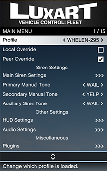

# LVC:Fleet Menu

### Main Menu

The LVC:Fleet menu can be opened by default using `O` as in Oscar this can be changed in [base settings](../../installation-and-configuration/configure-base-settings.md#register-key-maps).&#x20;

<figure><figcaption>
LVC:Fleet RageUI Menu
</figcaption></figure>

#### Profile

If multiple profiles are approved (assigned in [Assign Profiles](https://docs.luxartengineering.com/fleet/resource-installation/configure-base-settings#assign-profiles)) _Profile_ menu item will change which profile is currently being used. Changing this will reset un-saved settings for the current profile and load new profile settings.

#### Local Override

Selecting this will disable any assigned server side sirens for your vehicle and revert to client side siren. Currently, other players will here their client side sirens for your vehicle.&#x20;

#### Peer Override

Selecting this will override other players siren with your selected profile settings, if and only if, both profiles are of the same faction. See [VCFRoot Attributes](../../installation-and-configuration/customize-vcfs.md#vcfroot-attributes).

#### Primary Manual Tone

Change which tone is played when the cycle key (`R`) is held. Pressing Enter will open a tone rename window.

#### Secondary Manual Tone

Change which tone is played when the cycle key (`R`) and horn key (`E`) are held. Pressing Enter will open a tone rename window.

#### Auxiliary Siren Tone

Change which tone is played when the auxiliary siren (`up-arrow`). Pressing Enter will open a tone rename window.&#x20;

### Main Siren Settings

<figure><figcaption></figcaption></figure>

#### Airhorn Interrupt Mode

When vehicle siren is activated and the airhorn is activated, stop the siren and play only the airhorn. Otherwise, play both the siren and airhorn overtop of eachother.

#### Reset to Standby

Reset siren back to position 1 or the first siren tone when the siren is toggled. Otherwise, resume playing the previous tone.

#### Siren Park Kill

When the siren is activated and the player exits the vehicle, turn the siren off.

#### Tone Options

Each tone will be listed, the arrow keys will switch between _Cycle & Button, Cycle Only, Button Only, Disabled._ Where _Cycle_ means played when `R` cycle siren button is pressed; _Button_ is using the on-demand registered siren keys (default: `numrow1-0`); _Disabled_ prevents the siren from playing at all.

Selecting the item using the Enter will allow players to rename the tones.

### HUD Settings

<figure><figcaption></figcaption></figure>

#### Enabled

Toggle on screen siren controller HUD.

#### Move Mode

Selecting this enables NUI cursor, drag-and-drop the HUD to your desired location. Pressing right-click, Esc, Spacebar will exit move mode and save the HUDs location.

#### Scale

Change the size of siren controller HUD and save HUD scale.

#### Backlight

Changes HUD backlight mode. Auto: based on headlight state; Off: always off; On: always on.

#### Reset

Repositions HUD to it's default position. This can be used if the HUD is off screen.

### Audio Settings

<figure><figcaption></figcaption></figure>

#### Radio Controls

Toggles radio wheel functionality. By default holding the tilde key `` ` ``, located left of numrow 1, will open GTA V FM-radio wheel.

#### Siren Box Scheme

Changes which audio files are used for button sound effects. To change these see [Audio Element](../../installation-and-configuration/customize-vcfs.md#audio-element).

#### Manual Button Clicks

Determines if button sound effects are played when the manual siren keys (`R`) & (`R+E`) are pressed/released.

#### Airhorn Button Clicks

Determines if button sound effects are played when the horn key (`E`) is pressed / released.

#### Activity Reminder

When enabled, play reminder tone to the player if the emergency lights have been active for the selected amount of time is minutes and no siren controller key has been pressed. &#x20;

#### Adjust Volumes Menu

Allows for changing of sound effect volumes via slider. Pressing enter on a volume item will play it.

### Storage Management Menu

<figure><figcaption></figcaption></figure>

#### Save Settings

Save LVC:Fleet configuration and selected profile to players PC by the use of KVPs. On the right side of this button you can see the detected profile name in parenthesis, in this example 'LAPD'.

#### Load Settings

Load LVC:Fleet configuration and attempt to select the saved profile, if approved. On the right side of this button you can see the detected profile name in parenthesis, in this example 'LAPD'.

#### Copy Settings

Using this menu, players can copy configurations from other profiles if both profiles have the same approved tones. _Coming soon!_

#### Reset Settings

Reverts LVC:Fleet configuration to its default settings as outlined in the VCF. Useful for debugging.

#### Factory Reset

Deletes all LVC:Fleet saves and resets LVC:Fleet configuration to its default settings as outlined in VCF. Useful for debugging.
