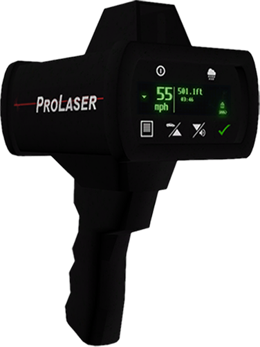
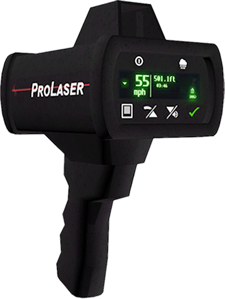

# 📩 Framework Guide

### QB-Core

**Weapon**

Create a new weapon for Pro Laser 4 with attributes in \
`qb-core/shared/weapons.lua`


```lua
[`weapon_prolaser4`] = { 
    ['name'] = 'weapon_prolaser4',
    ['label'] = 'Lidar Gun',
    ['ammotype'] = 'nil',
    ['damagereason'] = 'Ticketed / Fined / Caught Speeding / Slow Down'
},
```


**Item**

Create a new item for Pro Laser 4 with attributes in \
`qb-core/shared/items.lua`


```lua
['weapon_prolaser4'] = {
    ['name'] = 'weapon_prolaser4',
    ['label'] = 'Lidar Gun',
    ['weight'] = 1000,
    ['type'] = 'weapon',
    ['ammotype'] = 'nil',
    ['image'] = 'weapon_prolaser4.png',
    ['unique'] = true,
    ['useable'] = false,
    ['description'] = 'ProLaser4 Lidar Gun'
},
```


### Overextended

Create a new item for Pro Laser 4 with attributes in \
`ox_invetory/weapons.lua`


```lua
['WEAPON_PROLASER4'] = {
	label = 'Lidar Gun',
	weight = 700,
	durability = 0.1,
},
```


### Sample Weapon Icons

<div>

<figure><figcaption><p>Small</p></figcaption></figure>

 

<figure><figcaption><p>Small Brighter</p></figcaption></figure>

 

<figure><figcaption><p>Large</p></figcaption></figure>

 

<figure><figcaption><p>Large<br>Brighter</p></figcaption></figure>

</div>
