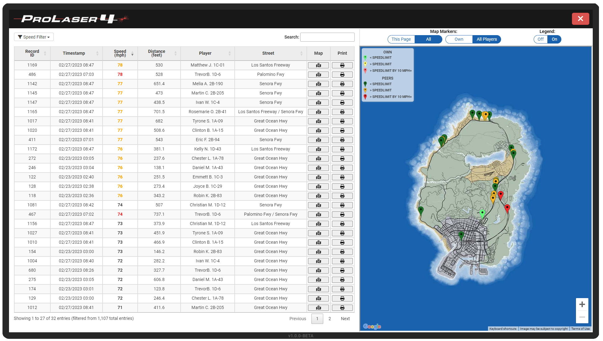
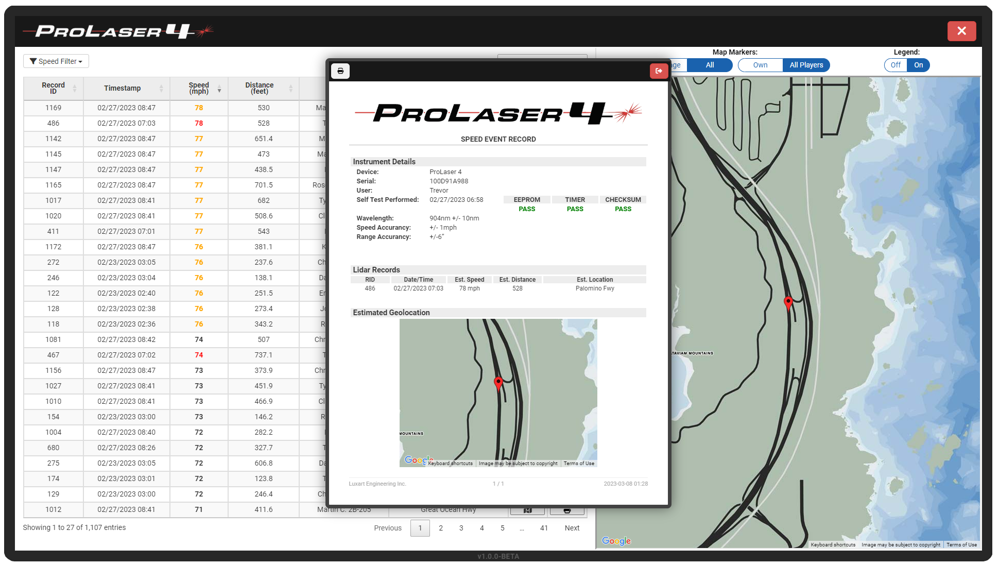
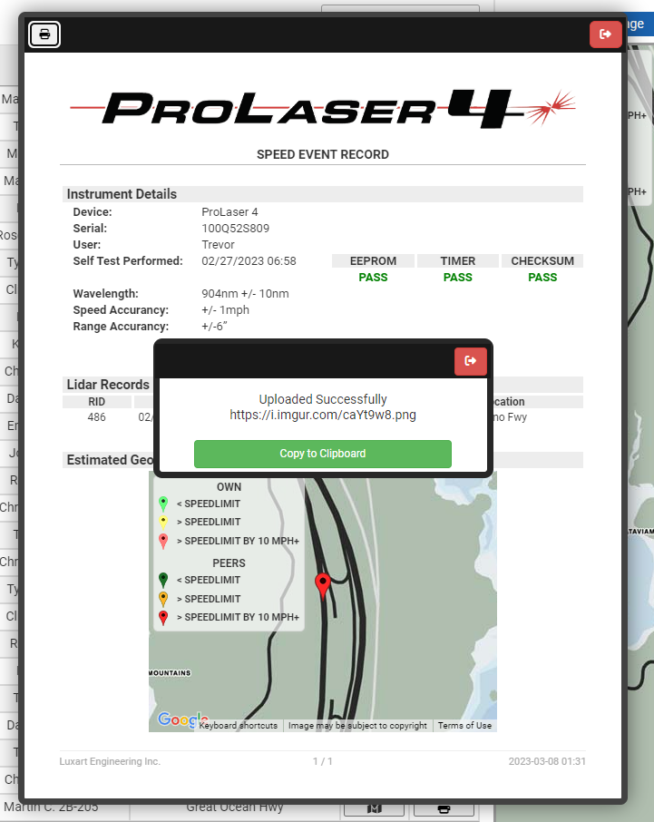

# 🎮 In Game Use Guide

### Open Lidar Display:

1. Spawn / Equip Pro Laser 4 Weapon.
2. Use `/lidar` or press `cfg.toggleMenu` control to open lidar display.

### **Controls:**

<table><thead><tr><th width="198" align="center">Key</th><th width="374.3333333333333">Description</th><th align="center">Type</th></tr></thead><tbody><tr><td align="center"><code>I</code></td><td>Toggle lidar display.</td><td align="center">Modifiable in FiveM Settings</td></tr><tr><td align="center"><code>C</code></td><td>Change sniper vs. simulated sight display in 1st person.</td><td align="center">Static</td></tr><tr><td align="center"><code>LEFT MOUSE</code></td><td>Clock target speed player is aimed at.</td><td align="center">Static</td></tr><tr><td align="center"><code>RIGHT MOUSE</code></td><td>Toggle aim.</td><td align="center">Static</td></tr><tr><td align="center"><code>RIGHT ARROW</code></td><td>Open history and scroll next, hold to fast scroll.</td><td align="center">Static</td></tr><tr><td align="center"><code>LEFT ARROW</code></td><td>Close history and scroll previous, hold to fast scroll.</td><td align="center">Static</td></tr><tr><td align="center"><code>SCROLLWHEEL UP</code></td><td>Zooms in.</td><td align="center">Static</td></tr><tr><td align="center"><code>SCROLLWHEEL DWN</code></td><td>Zooms out.</td><td align="center">Static</td></tr></tbody></table>

### Commands:

`/lidar` same as `I` key, toggles lidar display.

`/lidarwipe` clears lidar history save data.

`/lidarweapon` adds Pro Laser 4 weapon to ped.

`/lidarmove` to move and resize the on screen display.

`/lidarmove true` to reset on screen display size and location to defaults.

**If logging is enabled & configured:**\
`/lidarrecords` opens records tablet to view previous clock data.

### Interface Guide

<figure><figcaption>
Speed - Range Display / Home
</figcaption></figure>

<figure><figcaption>
Recalled Events / History
</figcaption></figure>

<figure><figcaption>
Reticle / Sight Display
</figcaption></figure>

### Range, Heading, and Entity Type Limitation

The lidar gun can clock AI vehicles up to your view distance (1100-1800 ft max.). Civilian vehicles clock range is limited by FiveM’s OneSync to 400-500 ft. It also has no built-in entity type limitations, it can clock vehicles, bicycles, peds, animals, and aircraft.&#x20;

**Cosine Error**

An effect when lidar gun (and therefore beam) and target are not perpendicular to each other. The larger the angle between the instrument and the target the larger the error in clocking a vehicle speed. This error results in an _underestimation_ of the vehicles speed, meaning the display will show a speed less than that of the actual target speed. While we can't actually measure the tangent or simulate the lidar beam, it is a rough estimation based on heading. The reduction also has a random scalar, to help simulate the different surfaces the beam may be hitting each with a different tangent.

It is important for players to be trained on this and understand the effects of Cosine error. The image below describes the mathematical relationship. You can read more at the link below.

<figure><figcaption>
Credit: <a href="https://copradar.com/chapts/chapt2/ch2d1.html">copradar.com/chapts/chapt2/ch2d1.html</a>
</figcaption></figure>

<figure><figcaption>
Credit: <a href="https://copradar.com/chapts/chapt2/ch2d1.html">copradar.com/chapts/chapt2/ch2d1.html</a>
</figcaption></figure>



### In Vehicle Angle Limits

While in vehicles, you are only able to clock vehicles within 110 degrees right and 178 degrees left, simulating inability to shoot through the rear windows. There are also camera limits when aimed in first person, against these limits causes the screen to jitter as the resource forces your camera back into allowable angles. The camera may also clip against the interior of the vehicle, this is expected and there isn’t really a solution.

In the future this will be expanded to support passenger seat angles: [product-roadmaps.md](../product-roadmaps.md "mention")

<figure><figcaption>
Angle Limitation In-Vehicle
</figcaption></figure>

### Calibration / Self-Test Behavior

If `cfg.requireCalibration` is set to true in config upon opening the lidar display or aiming down HUD sight for the first time the lidar will perform a self-test for 3 to 13 seconds. It will display a progress bar and a self-test timer. After calibration the lidar will display an empty speed-range layout.

### Recalled Events Menu

Every entity clocked will be added to the recalled events menu. If the clocked entity is the same as the last entity AND the new speed is higher than the stored speed in the recalled event table then the save data will be overridden to reflect new speed, range, and time.

<pre class="language-javascript" data-title="Update Pseudocode"><code class="lang-javascript"><strong>If (lastVeh == currVeh AND lastVehSpeed &#x3C; currVehSpeed){
</strong>    // update existing data to new speed, range, and time
}
</code></pre>

The recalled events menu can be navigated by pressing or holding `LEFT ARROW` or `RIGHT ARROW`. Holding either of these for 5 seconds will “fast-scroll” through the events. To close the recalled events menu navigate to the 1st record indicated by 1 in the top left corner and hit `LEFT ARROW` again. Recalled event data is saved every minute (if new data is present) and loaded on join.

### Records Tablet

If [persistent-records-and-tablet](persistent-records-and-tablet/ "mention") has been setup, then players in-game can review all players past clocks in accordance with logging settings in `config.lua`. The records tablet is a simulated tablet/laptop application that can retrieve all players previous clocks. It also allows printing clock data which includes information about the lidar gun, it's self-test state, and more.

Users clocks are submitted to the server every minute, if any are pending. All records waiting server side are inserted to the database every 5 minutes. As such, **the records tablet can have a delay of up to 6 minutes by default,** however this can be changed in the config under `cfg.loggingInsertInterval`**.**

<figure><figcaption>
Records Tablet Main Screen
</figcaption></figure>

<figure><figcaption>
Print Preview
</figcaption></figure>

<figure><figcaption>
Print To Image
</figcaption></figure>
